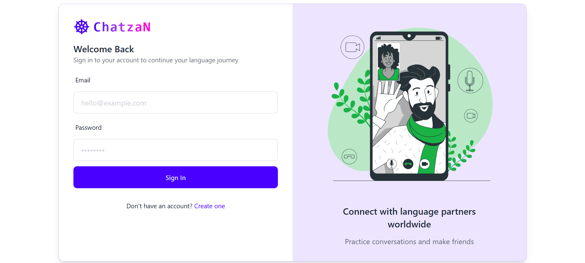
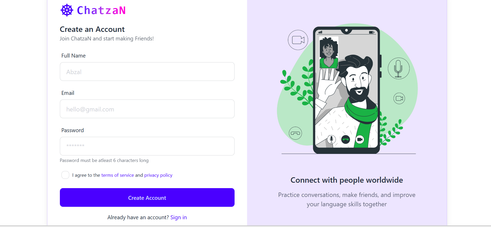
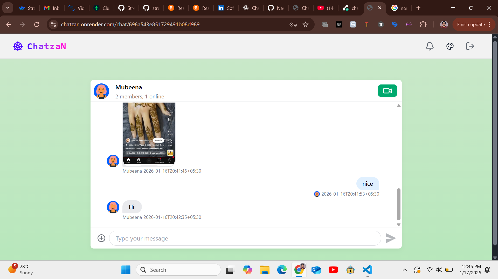

# Chatzan 💬
## Real-Time Chat Application

Chatzan is a full-stack real-time chat application built with modern web technologies and a production-ready architecture. It features secure authentication, user discovery, friend requests, and scalable real-time messaging powered by **Stream (GetStream) Chat API**.

This project is fully developed, deployed, and suitable for **portfolio, resume, and interview discussions**.

---

## 🚀 Live Demo

- **Live URL:** https://chatzan.onrender.com/
- **GitHub Repository:** https://github.com/shaikabzal9676/chatzan

---

## 📸 Application Preview

  
  



---

## 🧠 Project Overview

Chatzan allows users to:

- Register and log in securely  
- Discover recommended users  
- Send and manage friend requests  
- Chat And Video call in real time with connected users  
- Experience a responsive and modern UI  

Instead of implementing raw WebSockets, this application integrates **Stream Chat**, a production-grade real-time messaging platform used by large-scale applications.

---

## ✨ Features

- 🔐 JWT-based authentication  
- 🔒 Secure password hashing with bcrypt  
- 👥 User discovery & recommendations  
- 🤝 Friend request system  
- 💬 Real-time 1-to-1 chat using Stream Chat  
- ⚡ Optimized state management & caching  
- 🎨 Responsive UI with Tailwind & DaisyUI  
- 🌐 Fully deployed full-stack application  

---

## 🛠️ Tech Stack

### Frontend
- React 19 (Vite)
- JavaScript (ES6+)
- Tailwind CSS
- DaisyUI
- Zustand (state management)
- TanStack React Query
- Axios
- Stream Chat React SDK

### Backend
- Node.js
- Express.js
- MongoDB
- Mongoose
- JWT Authentication
- bcrypt.js
- Stream Chat Server SDK

### Real-Time Messaging
- Stream (GetStream) Chat API

### Deployment
- Render

---

## 🏗️ Project Structure

chatzan/
├── backend/
│ ├── controllers/
│ ├── models/
│ ├── routes/
│ ├── middleware/
│ └── server.js
│
├── frontend/
│ ├── src/
│ ├── components/
│ ├── pages/
│ └── main.jsx
│
└── README.md

yaml
Copy code

---

## ⚙️ Environment Variables

Create a `.env` file inside the **backend** directory:

```env
PORT=5001
MONGO_URI=your_mongodb_connection_string
JWT_SECRET=your_jwt_secret

STREAM_API_KEY=your_stream_api_key
STREAM_API_SECRET=your_stream_api_secret
STREAM_APP_ID=your_stream_app_id

CLIENT_URL=http://localhost:5173
▶️ Run the Project Locally
1️⃣ Clone the Repository
bash
Copy code
git clone https://github.com/shaikabzal9676/chatzan.git
cd chatzan
2️⃣ Backend Setup
bash
Copy code
cd backend
npm install
npm run dev
Backend runs on:
http://localhost:5001

3️⃣ Frontend Setup
bash
Copy code
cd frontend
npm install
npm run dev
Frontend runs on:
http://localhost:5173
